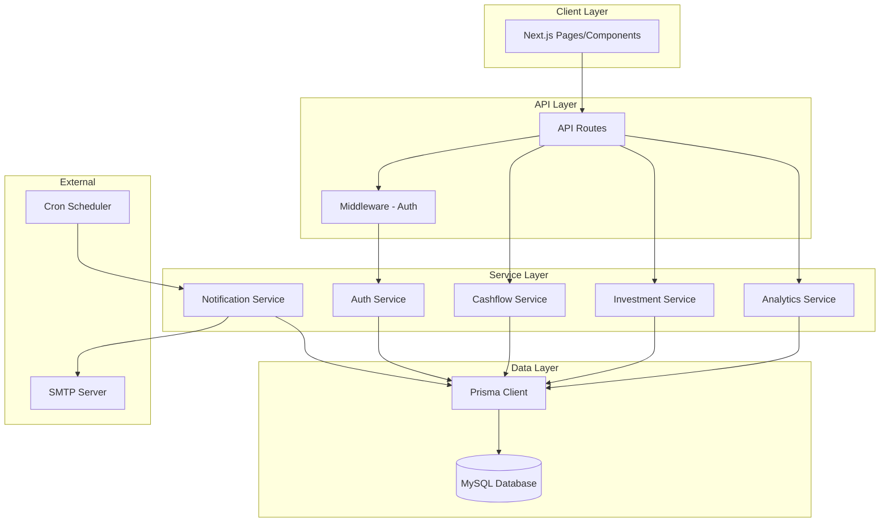
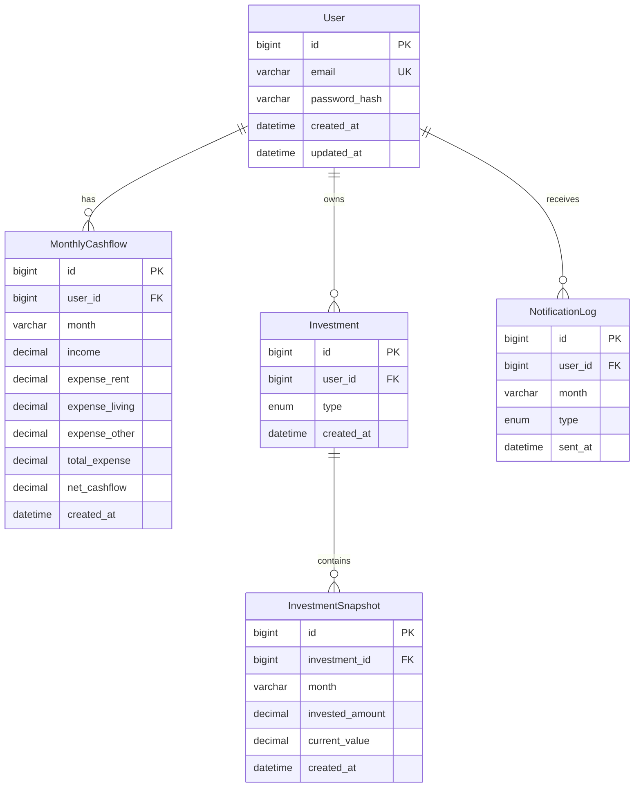

# Design Document

## Overview

This design document describes the architecture and implementation approach for the Personal Finance & Investment Tracker application. The system is built using Next.js (App Router) with TypeScript, MySQL database via Prisma ORM, NextAuth.js for authentication, and Nodemailer for SMTP email notifications.

The application follows a layered architecture with clear separation between presentation (React components), API routes, business logic services, and data access layer (Prisma).

## Architecture



### Request Flow

1. Client makes request to API route
2. Middleware validates JWT session for protected routes
3. API route delegates to appropriate service
4. Service executes business logic and interacts with Prisma
5. Response formatted using standard API response helper
6. JSON response returned to client

## Components and Interfaces

### API Response Helper

```typescript
interface APIResponse<T = unknown> {
  responseCode: number;
  responseStatus: 'SUCCESS' | 'ERROR';
  responseMessage: string;
  responseDetails: T | null;
}

function responseAPI<T>(
  code: number,
  status: 'SUCCESS' | 'ERROR',
  message: string,
  data: T | null
): APIResponse<T>;
```

### Authentication Service

```typescript
interface AuthService {
  register(email: string, password: string): Promise<User>;
  validateCredentials(email: string, password: string): Promise<User | null>;
  hashPassword(password: string): Promise<string>;
  verifyPassword(password: string, hash: string): Promise<boolean>;
}
```

### Cashflow Service

```typescript
interface CashflowInput {
  month: string; // YYYY-MM format
  income: number;
  expense_rent: number;
  expense_living: number;
  expense_other: number;
}

interface CashflowRecord extends CashflowInput {
  id: bigint;
  user_id: bigint;
  total_expense: number;
  net_cashflow: number;
  created_at: Date;
}

interface CashflowService {
  saveCashflow(userId: bigint, input: CashflowInput): Promise<CashflowRecord>;
  getCashflowByMonth(userId: bigint, month: string): Promise<CashflowRecord | null>;
  getCashflowHistory(userId: bigint): Promise<CashflowRecord[]>;
  calculateTotalExpense(input: CashflowInput): number;
  calculateNetCashflow(income: number, totalExpense: number): number;
}
```

### Investment Service

```typescript
type InvestmentType = 'GOLD' | 'MUTUAL_FUND';

interface InvestmentSnapshotInput {
  type: InvestmentType;
  month: string; // YYYY-MM format
  invested_amount: number;
  current_value: number;
}

interface InvestmentSnapshot extends InvestmentSnapshotInput {
  id: bigint;
  investment_id: bigint;
  gain_loss: number;
  created_at: Date;
}

interface InvestmentService {
  saveSnapshot(userId: bigint, input: InvestmentSnapshotInput): Promise<InvestmentSnapshot>;
  getSnapshotsByInvestment(investmentId: bigint): Promise<InvestmentSnapshot[]>;
  getSnapshotsByUserAndType(userId: bigint, type: InvestmentType): Promise<InvestmentSnapshot[]>;
  calculateGainLoss(investedAmount: number, currentValue: number): number;
}
```

### Analytics Service

```typescript
interface CashflowTrend {
  month: string;
  net_cashflow: number;
}

interface PortfolioSummary {
  total_invested: number;
  total_current_value: number;
  total_gain_loss: number;
}

interface InvestmentComparison {
  gold: PortfolioSummary;
  mutual_fund: PortfolioSummary;
}

interface AnalyticsService {
  getCashflowTrend(userId: bigint): Promise<CashflowTrend[]>;
  getPortfolioSummary(userId: bigint): Promise<PortfolioSummary>;
  getPortfolioGrowth(userId: bigint): Promise<InvestmentSnapshot[]>;
  getInvestmentComparison(userId: bigint): Promise<InvestmentComparison>;
}
```

### Notification Service

```typescript
type NotificationType = 'REMINDER' | 'SUMMARY';

interface NotificationLog {
  id: bigint;
  user_id: bigint;
  month: string;
  type: NotificationType;
  sent_at: Date;
}

interface EmailContent {
  to: string;
  subject: string;
  html: string;
}

interface NotificationService {
  sendMonthlyNotifications(): Promise<void>;
  sendReminderEmail(user: User): Promise<void>;
  sendSummaryEmail(user: User, cashflow: CashflowRecord, investments: InvestmentSnapshot[]): Promise<void>;
  logNotification(userId: bigint, month: string, type: NotificationType): Promise<NotificationLog>;
  buildSummaryEmailContent(cashflow: CashflowRecord, investments: InvestmentSnapshot[]): EmailContent;
}
```

### AI Investment Recommendation Service

```typescript
interface AllocationRecommendation {
  gold_percentage: number;        // 0-100
  mutual_fund_percentage: number; // 0-100
  investable_amount: number;      // Suggested amount to invest this month
  reasoning: string;              // Explanation in Bahasa Indonesia
  risk_profile: 'conservative' | 'moderate' | 'aggressive';
  should_invest: boolean;         // false if should focus on emergency fund
  warnings: string[];             // Any warnings or caveats
}

interface FinancialHealth {
  average_net_cashflow: number;
  cashflow_volatility: number;    // Standard deviation of net_cashflow
  months_of_data: number;
  has_emergency_fund: boolean;    // Estimated based on positive cashflow history
}

interface PortfolioBalance {
  gold_current_percentage: number;
  mutual_fund_current_percentage: number;
  total_portfolio_value: number;
  gold_performance: number;       // Gain/loss percentage
  mutual_fund_performance: number;
}

interface RecommendationService {
  getInvestmentRecommendation(userId: bigint): Promise<AllocationRecommendation>;
  analyzeFinancialHealth(cashflows: CashflowRecord[]): FinancialHealth;
  analyzePortfolioBalance(snapshots: InvestmentSnapshot[]): PortfolioBalance;
  calculateRecommendedAllocation(
    health: FinancialHealth, 
    balance: PortfolioBalance
  ): AllocationRecommendation;
  generateReasoningText(
    health: FinancialHealth,
    balance: PortfolioBalance,
    allocation: { gold: number; mutual_fund: number }
  ): string;
}

// Recommendation Logic Rules:
// 1. If average_net_cashflow < 0: recommend building emergency fund first
// 2. If months_of_data < 3: recommend conservative allocation (more gold)
// 3. If cashflow_volatility is high: recommend more stable assets (gold)
// 4. If portfolio heavily weighted to one type: recommend rebalancing
// 5. Base allocation: 40% Gold (stable), 60% Mutual Fund (growth potential)
// 6. Adjust based on performance: shift slightly toward better performer
// 7. Never recommend 100% in single asset (diversification principle)
```

### User Settings Service

```typescript
interface UserSettings {
  ai_recommendation_enabled: boolean;
}

interface SettingsService {
  getUserSettings(userId: bigint): Promise<UserSettings>;
  updateAIRecommendationSetting(userId: bigint, enabled: boolean): Promise<UserSettings>;
  isAIRecommendationEnabled(userId: bigint): Promise<boolean>;
}
```

### Validation Utilities

```typescript
interface ValidationResult {
  valid: boolean;
  errors: string[];
}

interface Validator {
  validateMonth(month: string): ValidationResult;
  validateMonetaryValue(value: number, fieldName: string): ValidationResult;
  validateInvestmentType(type: string): ValidationResult;
  validateEmail(email: string): ValidationResult;
  validatePassword(password: string): ValidationResult;
  validateCashflowInput(input: CashflowInput): ValidationResult;
  validateSnapshotInput(input: InvestmentSnapshotInput): ValidationResult;
}
```

### Encryption Utilities

```typescript
interface EncryptionService {
  encrypt(plaintext: string): string;
  decrypt(ciphertext: string): string;
  encryptNumber(value: number): string;
  decryptNumber(ciphertext: string): number;
}

// Implementation uses AES-256-GCM with key from ENCRYPTION_KEY env variable
// Format: iv:authTag:ciphertext (base64 encoded)
```

## Data Models

### Prisma Schema

```prisma
model User {
  id            BigInt           @id @default(autoincrement())
  email         String           @unique @db.VarChar(512) // Encrypted, needs more space
  password_hash String           @db.VarChar(255)
  ai_recommendation_enabled Boolean @default(true)
  created_at    DateTime         @default(now())
  updated_at    DateTime         @updatedAt
  
  cashflows     MonthlyCashflow[]
  investments   Investment[]
  notifications NotificationLog[]
  
  @@map("users")
}

model MonthlyCashflow {
  id             BigInt   @id @default(autoincrement())
  user_id        BigInt
  month          String   @db.VarChar(7)
  income         String   @db.VarChar(255) // Encrypted decimal
  expense_rent   String   @db.VarChar(255) // Encrypted decimal
  expense_living String   @db.VarChar(255) // Encrypted decimal
  expense_other  String   @db.VarChar(255) // Encrypted decimal
  total_expense  String   @db.VarChar(255) // Encrypted decimal
  net_cashflow   String   @db.VarChar(255) // Encrypted decimal
  created_at     DateTime @default(now())
  
  user User @relation(fields: [user_id], references: [id])
  
  @@unique([user_id, month])
  @@map("monthly_cashflow")
}

model Investment {
  id         BigInt              @id @default(autoincrement())
  user_id    BigInt
  type       InvestmentType
  created_at DateTime            @default(now())
  
  user      User                 @relation(fields: [user_id], references: [id])
  snapshots InvestmentSnapshot[]
  
  @@unique([user_id, type])
  @@map("investments")
}

model InvestmentSnapshot {
  id              BigInt   @id @default(autoincrement())
  investment_id   BigInt
  month           String   @db.VarChar(7)
  invested_amount String   @db.VarChar(255) // Encrypted decimal
  current_value   String   @db.VarChar(255) // Encrypted decimal
  created_at      DateTime @default(now())
  
  investment Investment @relation(fields: [investment_id], references: [id])
  
  @@unique([investment_id, month])
  @@map("investment_snapshots")
}

model NotificationLog {
  id      BigInt           @id @default(autoincrement())
  user_id BigInt
  month   String           @db.VarChar(7)
  type    NotificationType
  sent_at DateTime         @default(now())
  
  user User @relation(fields: [user_id], references: [id])
  
  @@map("notification_logs")
}

enum InvestmentType {
  GOLD
  MUTUAL_FUND
}

enum NotificationType {
  REMINDER
  SUMMARY
}
```

### Entity Relationships




## Correctness Properties

*A property is a characteristic or behavior that should hold true across all valid executions of a system—essentially, a formal statement about what the system should do. Properties serve as the bridge between human-readable specifications and machine-verifiable correctness guarantees.*

### Property 1: Password Hashing Round-Trip

*For any* valid email and password combination, registering a user and then verifying the password against the stored hash should return true, while verifying any different password should return false.

**Validates: Requirements 1.1, 1.3**

### Property 2: Duplicate Email Rejection

*For any* registered user email, attempting to register another user with the same email should be rejected with an error response.

**Validates: Requirements 1.2**

### Property 3: Invalid Credentials Rejection

*For any* login attempt where the email does not exist or the password does not match the stored hash, the system should reject the login with an error response.

**Validates: Requirements 1.4**

### Property 4: Total Expense Calculation Invariant

*For any* cashflow input with expense_rent, expense_living, and expense_other values, the calculated total_expense should equal exactly expense_rent + expense_living + expense_other.

**Validates: Requirements 2.1**

### Property 5: Net Cashflow Calculation Invariant

*For any* cashflow input with income and calculated total_expense, the net_cashflow should equal exactly income - total_expense.

**Validates: Requirements 2.2**

### Property 6: Cashflow Persistence Round-Trip

*For any* valid cashflow input saved to the database, retrieving the cashflow by user and month should return a record with all original input values preserved and calculated values correct.

**Validates: Requirements 2.3**

### Property 7: Cashflow History Completeness

*For any* user with N saved cashflow records across different months, requesting cashflow history should return exactly N records, one for each saved month.

**Validates: Requirements 2.4**

### Property 8: Cashflow Upsert Idempotence

*For any* cashflow input saved twice for the same user and month (with potentially different values on second save), there should be exactly one record for that user-month combination, containing the values from the second save.

**Validates: Requirements 2.5**

### Property 9: Monetary Value Validation

*For any* input containing a negative monetary value (income, expenses, invested_amount, or current_value), the system should reject the input with a validation error.

**Validates: Requirements 2.6, 3.6**

### Property 10: Investment Type Validation

*For any* investment creation or snapshot submission with a type value that is not exactly "GOLD" or "MUTUAL_FUND", the system should reject the input with a validation error.

**Validates: Requirements 3.1**

### Property 11: Investment Snapshot Persistence Round-Trip

*For any* valid investment snapshot input saved to the database, retrieving the snapshot by investment and month should return a record with invested_amount and current_value matching the original input.

**Validates: Requirements 3.2**

### Property 12: Gain/Loss Calculation Invariant

*For any* investment snapshot with invested_amount and current_value, the calculated gain_loss should equal exactly current_value - invested_amount.

**Validates: Requirements 3.3**

### Property 13: Investment History Completeness

*For any* investment with N saved snapshots across different months, requesting investment history should return exactly N snapshots.

**Validates: Requirements 3.4**

### Property 14: Snapshot Upsert Idempotence

*For any* snapshot input saved twice for the same investment and month, there should be exactly one snapshot for that investment-month combination, containing the values from the second save.

**Validates: Requirements 3.5**

### Property 15: Portfolio Aggregation Correctness

*For any* user with multiple investment snapshots, the portfolio summary's total_invested should equal the sum of all invested_amounts, and total_current_value should equal the sum of all current_values, with correct separation by investment type.

**Validates: Requirements 4.2, 4.4**

### Property 16: API Response Structure Consistency

*For any* API endpoint call (success or failure), the response should contain exactly four fields: responseCode (number), responseStatus ("SUCCESS" or "ERROR"), responseMessage (non-empty string), and responseDetails (object, array, or null).

**Validates: Requirements 5.1, 5.2, 5.3, 5.4, 5.5, 5.6**

### Property 17: Notification Type Selection

*For any* user during monthly notification processing, if cashflow data exists for the current month then a SUMMARY notification should be sent, otherwise a REMINDER notification should be sent.

**Validates: Requirements 6.1, 6.2**

### Property 18: Summary Email Content Completeness

*For any* summary email generated, the email content should contain the month, total income, total expense, net cashflow, Gold investment summary, and Mutual Fund investment summary.

**Validates: Requirements 6.3**

### Property 19: Notification Logging Completeness

*For any* email notification sent, a corresponding notification log record should exist with matching user_id, month, type, and a valid sent_at timestamp.

**Validates: Requirements 6.4**

### Property 20: Month Format Validation

*For any* month input that does not match the pattern YYYY-MM (where YYYY is a 4-digit year and MM is 01-12), the system should reject the input with a validation error.

**Validates: Requirements 7.3**

### Property 21: Invalid Input Rejection

*For any* API request with missing required fields or invalid field types, the system should return an error response with responseCode 400.

**Validates: Requirements 7.1, 7.2**

### Property 22: Unauthorized Request Rejection

*For any* request to a protected endpoint without a valid authentication session, the system should return an error response with responseCode 401.

**Validates: Requirements 7.5**

### Property 23: Encryption Round-Trip

*For any* string or numeric value, encrypting and then decrypting should return the original value exactly.

**Validates: Requirements 10.1, 10.2, 10.3**

### Property 24: Encrypted Data at Rest

*For any* saved cashflow or investment snapshot, querying the raw database should return encrypted (non-readable) values for email and monetary fields, not plaintext.

**Validates: Requirements 10.2, 10.6**

### Property 25: Allocation Percentage Sum Invariant

*For any* investment recommendation generated, the sum of gold_percentage and mutual_fund_percentage should equal exactly 100.

**Validates: Requirements 11.2**

### Property 26: Negative Cashflow Emergency Fund Recommendation

*For any* user with negative average net_cashflow over their history, the recommendation should have should_invest set to false and reasoning should mention building emergency fund.

**Validates: Requirements 11.5**

### Property 27: Diversification Constraint

*For any* investment recommendation where should_invest is true, neither gold_percentage nor mutual_fund_percentage should be 0% or 100% (must be between 10-90% for diversification).

**Validates: Requirements 11.6**

### Property 28: Recommendation Reasoning Completeness

*For any* investment recommendation generated, the reasoning field should be non-empty, in Bahasa Indonesia, and explain the allocation rationale.

**Validates: Requirements 11.4**

### Property 29: AI Setting Toggle Persistence

*For any* user who changes their AI recommendation setting, the new value should be persisted and returned correctly on subsequent queries.

**Validates: Requirements 12.4, 12.6**

### Property 30: AI Setting Default Value

*For any* newly registered user, the ai_recommendation_enabled setting should default to true.

**Validates: Requirements 12.5**

## Error Handling

### Validation Errors (400)

- Missing required fields in request body
- Invalid field types (e.g., string instead of number)
- Invalid month format (not YYYY-MM)
- Negative monetary values
- Invalid investment type
- Invalid email format
- Password too short or missing requirements

### Authentication Errors (401)

- Missing or invalid JWT token
- Expired session
- Invalid credentials during login

### Conflict Errors (409)

- Duplicate email during registration

### Server Errors (500)

- Database connection failures
- SMTP delivery failures
- Unexpected runtime exceptions

### Error Response Format

All errors follow the standard API response format:

```typescript
{
  responseCode: 400 | 401 | 409 | 500,
  responseStatus: 'ERROR',
  responseMessage: 'Human-readable error description',
  responseDetails: {
    field?: string,      // Field that caused the error (for validation)
    errors?: string[]    // List of validation errors
  } | null
}
```

## Testing Strategy

### Testing Framework

- **Unit Tests**: Jest with TypeScript
- **Property-Based Tests**: fast-check library
- **Integration Tests**: Jest with Prisma test utilities
- **E2E Tests**: Playwright (optional, for UI flows)

### Unit Testing Approach

Unit tests verify specific examples and edge cases:

- Service method behavior with known inputs
- Validation function edge cases (empty strings, boundary values)
- API response helper formatting
- Email content generation

### Property-Based Testing Approach

Property tests verify universal properties across randomly generated inputs:

- Each property from the Correctness Properties section implemented as a property test
- Minimum 100 iterations per property test
- Custom generators for domain types (valid emails, months, monetary values)
- Tag format: **Feature: personal-finance-tracker, Property {number}: {property_text}**

### Test Organization

```
src/
├── services/
│   ├── auth.service.ts
│   ├── auth.service.test.ts        # Unit tests
│   ├── auth.service.property.test.ts  # Property tests
│   ├── cashflow.service.ts
│   ├── cashflow.service.test.ts
│   ├── cashflow.service.property.test.ts
│   └── ...
├── lib/
│   ├── validation.ts
│   ├── validation.test.ts
│   ├── validation.property.test.ts
│   ├── api-response.ts
│   └── api-response.test.ts
└── __tests__/
    └── integration/
        ├── cashflow.integration.test.ts
        └── investment.integration.test.ts
```

### Property Test Configuration

```typescript
import fc from 'fast-check';

// Configure minimum iterations
const propertyConfig = { numRuns: 100 };

// Custom generators
const validEmail = fc.emailAddress();
const validMonth = fc.date().map(d => 
  `${d.getFullYear()}-${String(d.getMonth() + 1).padStart(2, '0')}`
);
const monetaryValue = fc.float({ min: 0, max: 999999999999.99 })
  .map(v => Math.round(v * 100) / 100);
const investmentType = fc.constantFrom('GOLD', 'MUTUAL_FUND');
```

### Test Coverage Requirements

- All calculation functions: 100% coverage via property tests
- All validation functions: Property tests for valid/invalid inputs
- All service methods: Unit tests for happy path + edge cases
- API response helper: Property test for structure consistency
- Integration tests for database round-trips
